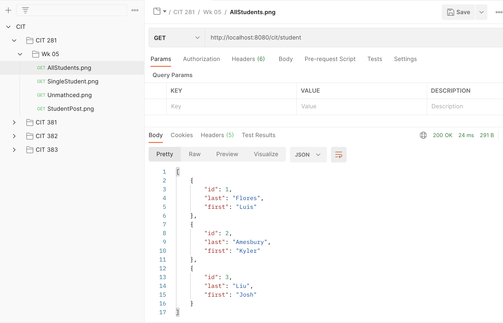
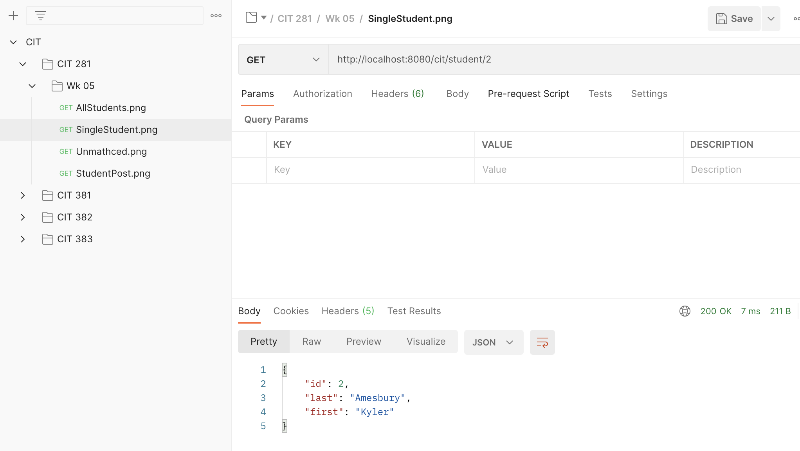
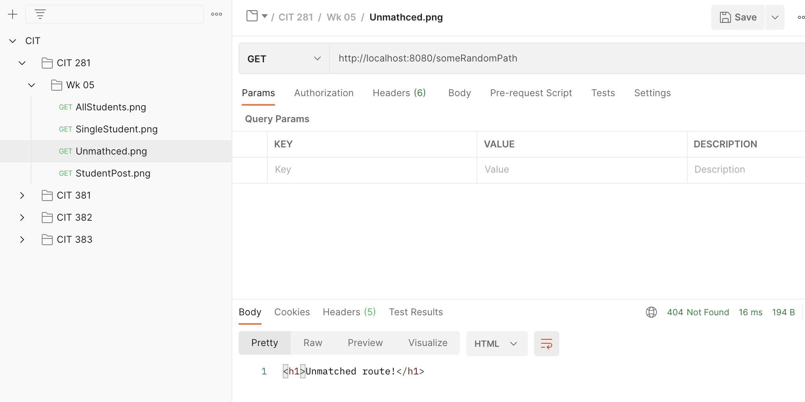
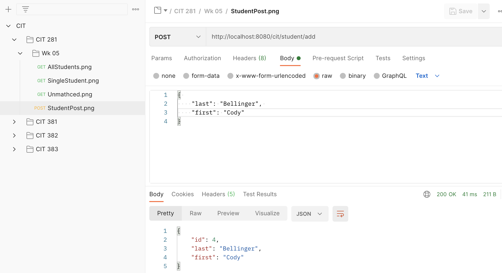

## File Overview:

- fastify-server.js: A basic REST API using a in file database of students. The API uses various routes and handles different kinds of requests.

   
   
  
- package.json: Packages used for this lab.
